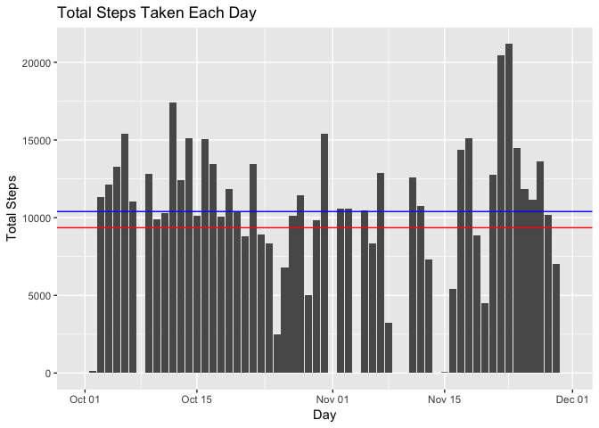
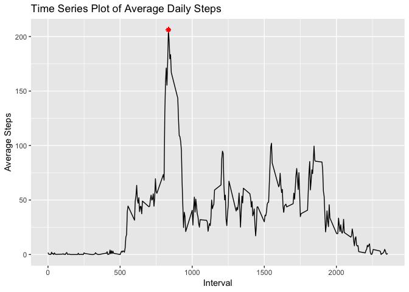
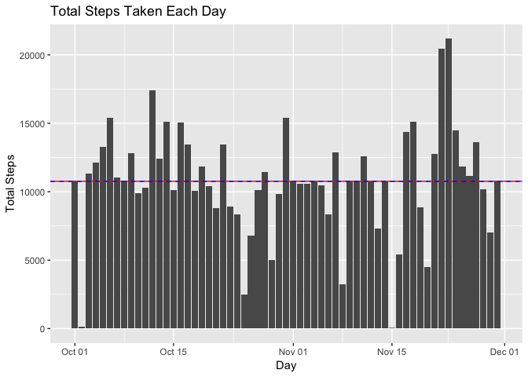
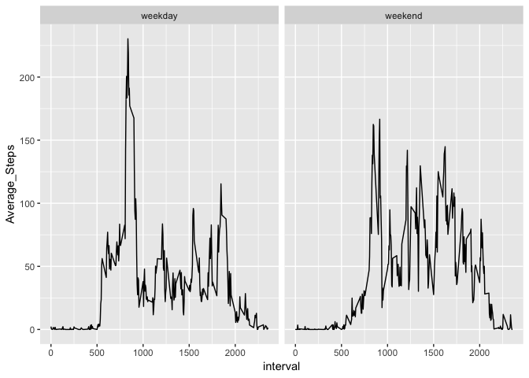

##Loading and preprocessing the data
Steps Taken:
- Load libraries
- Unzip the file
- Load in the data
- Count the number of missing values


```r
library(dplyr)
```

```
## 
## Attaching package: 'dplyr'
```

```
## The following objects are masked from 'package:stats':
## 
##     filter, lag
```

```
## The following objects are masked from 'package:base':
## 
##     intersect, setdiff, setequal, union
```

```r
library(ggplot2)
unzip('~/Documents/Coursera/Reproducible_Research/repdata%2Fdata%2Factivity.zip')
Act_Data <- read.csv('activity.csv')
missing_num <- sum(is.na(Act_Data$steps))
```

##What is mean total number of steps taken per day?
For this section entries with missing values are not included.
Steps taken:
- Create a new table with the data grouped by day and the total steps for each day calculated.
- Calculate the mean and standard deviation of the daily totals.
- Plot a histogram of the daily totals.  
- Add red and blue lines to the histogram showing the mean and median respectively.


```r
Step_by_day <- Act_Data %>%
  group_by(date) %>%
  summarize(sum(steps, na.rm = TRUE))
colnames(Step_by_day) <- c('day', 'steps')
Step_by_day$day <- as.Date(Step_by_day$day)
mean_steps <- mean(Step_by_day$steps)
median_steps <- median(Step_by_day$steps)

ggplot(Step_by_day, aes(x = day, y = steps)) +
  geom_histogram(stat = 'identity') + 
  geom_hline(yintercept = mean_steps, color = 'red') + 
  geom_hline(yintercept = median_steps, color = 'blue') + 
  labs(title = 'Total Steps Taken Each Day',
       x = 'Day', y = 'Total Steps')
```

<!-- -->

###The histogram shows the total steps taken on each day.
1. The mean number of steps per day is 9354.22950819672 steps and is shown with a red line on the histogram.
2. The median number of steps per day is 10395 steps and is shown with a blue line on the histogram.


##What is the average daily activity pattern?
For this section entries with missing values are not included.
Steps taken:
- Create a new table with the data grouped by interval and the average steps for each interval calculated.
- Calculate the maximum for the average steps.
- Plot a line graph of the average steps over all the intervals.  
- Add  a red star at the maximum.


```r
Step_by_interval <- Act_Data %>%
  group_by(interval) %>%
  summarize(mean(steps, na.rm = TRUE))
colnames(Step_by_interval) <- c('interval', 'Average_Steps')
Step_by_interval$interval <- as.numeric(Step_by_interval$interval)
max_interval <- subset(Step_by_interval, Step_by_interval$Average_Steps == max(Step_by_interval$Average_Steps))

ggplot(Step_by_interval, aes(x = interval, y = Average_Steps)) +
  geom_line() +
  geom_point(aes(x = max_interval$interval, y = max_interval$Average_Steps), 
             color = 'red', pch = 8) + 
  labs(title = 'Time Series Plot of Average Daily Steps',
       x = 'Interval', y = 'Average Steps')
```

<!-- -->

###The average number of steps taken during each 5-minute interval (averaged across all days) is shown in the line graph.
1. The maximum average number of steps occurs in the 835th 5-minute interval.  This interval has an average of 206.169811320755 steps. This point is shown on the graph with a red star.


##Imputing missing values
There are 2304 days/intervals where there are missing values. The presence of missing days may introduce bias into some calculations or summaries of the data.  **In order to better calculate summaries for the data, missing values will be replaced by the mean value for that interval rounded to the nearest integer.**
Steps taken:
- For each missing value identify the interval, look up the average steps for that interval, add that value to the table.
- Create a new table with the new data grouped by day and the total steps for each day calculated.
- Calculate the mean and standard deviation of the daily totals.
- Plot a histogram of the daily totals.  
- Add red and blue lines to the histogram showing the mean and median respectively.

```r
Act_Data_Clean <- Act_Data

for (i in 1:length(Act_Data_Clean$steps)){
  if (is.na(Act_Data_Clean$steps[i])){
    Act_Data_Clean$steps[i] <- 
      round(subset(Step_by_interval$Average_Steps, 
                   Step_by_interval$interval == Act_Data_Clean$interval[i]))
  }
}
Step_by_day_clean <- Act_Data_Clean %>%
  group_by(date) %>%
  summarize(sum(steps))
colnames(Step_by_day_clean) <- c('day', 'steps')
Step_by_day_clean$day <- as.Date(Step_by_day_clean$day)
mean_steps_clean <- mean(Step_by_day_clean$steps)
median_steps_clean <- median(Step_by_day_clean$steps)

ggplot(Step_by_day_clean, aes(x = day, y = steps)) +
  geom_histogram(stat = 'identity') + 
  geom_hline(yintercept = mean_steps_clean, color = 'red') + 
  geom_hline(yintercept = median_steps_clean, color = 'blue', linetype = 2) + 
  labs(title = 'Total Steps Taken Each Day',
       x = 'Day', y = 'Total Steps')
```

<!-- -->

###The histogram shows the total steps taken on each day.
1. The mean number of steps per day is 10765.6393442623 steps and is shown with a red line on the histogram.
2. The median number of steps per day is 10762 steps and is shown with a blue line on the histogram.
3. Both the mean and median have increased compared to the data with the missing values ignored.  Interestigly in this dataset the mean and median are almost equal.  Imputing the missing data has increased the values of a lot of the totals for each day as well.


##Are there differences in activity patterns between weekdays and weekends?
For this section the data with imputed values is used.
Steps taken:
- Add a column with the weekday
- Add a factor column with the category 'weekday' or 'weekend'
- Group the data by interval and week category.  Calculate the average steps for each group.
- Create two line graphs of interval vs. steps taken showing the comparison between weekdays and weekends.

```r
Act_Data_Clean$date <- as.Date(Act_Data_Clean$date)
Act_Data_Clean$weekday <- as.character(weekdays(Act_Data_Clean$date))
Weekend <- function(weekday){
  if (weekday %in% c('Saturday', 'Sunday')){
    return('weekend')
  }else{
    return('weekday')
  }
}
Act_Data_Clean$dayFactor <- as.factor(sapply(Act_Data_Clean$weekday, Weekend))

Step_by_interval_week <- Act_Data_Clean %>%
  group_by(interval, dayFactor) %>%
  summarize(mean(steps, na.rm = TRUE))
colnames(Step_by_interval_week) <- c('interval', 'Type', 'Average_Steps')
Step_by_interval_week$interval <- as.numeric(Step_by_interval_week$interval)

ggplot(Step_by_interval_week, aes(x = interval, y = Average_Steps)) +
  geom_line() +
  facet_wrap(~Type)
```

<!-- -->

```r
  labs(x = 'Interval', y = 'Average Steps')
```

```
## $x
## [1] "Interval"
## 
## $y
## [1] "Average Steps"
## 
## attr(,"class")
## [1] "labels"
```
```
